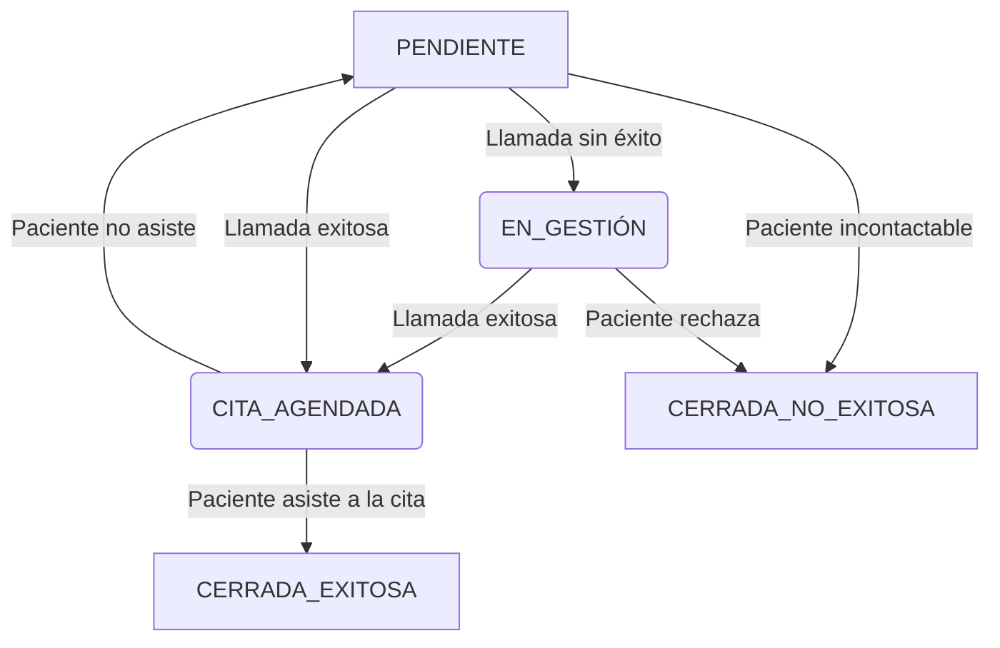

# Propuesta del Equipo Experto Externo: Arquitectura de Backend Unificado y Frontends Especializados

**Para:** Equipo de Desarrollo Principal, IPS Santa Helena del Valle
**De:** Equipo Asesor Externo (Gemini)
**Fecha:** 12 de septiembre, 2025
**Asunto:** Consolidación del análisis estratégico y la arquitectura recomendada para la plataforma de gestión de RIAS.

---

## Introducción

Este documento consolida el análisis y las recomendaciones estratégicas proporcionadas por el equipo asesor externo. El objetivo es documentar el razonamiento que, partiendo de un caso de uso operativo clave (la demanda inducida), nos lleva a la validación de un patrón arquitectónico final: un backend unificado y modular con experiencias de frontend especializadas por rol. Se presenta el diálogo y el análisis en el orden en que se produjo para dar total transparencia al proceso de toma de decisiones.

---

## Sección 1: El Valor Inmediato de la Plataforma - El Motor de Salud Proactiva

El análisis comenzó con una pregunta fundamental que se aleja de las futuras capacidades de IA y se centra en el valor operativo inmediato del sistema que se está construyendo.

> **Pregunta Inicial:** "...el RAG es un paso posterior a tener una base de datos muy bien estructurada como la que estamos construyendo, eso lo tengo claro, sin embargo el sistema que estamos construyendo por si solo si es de gran soporte para la IPS, en gestiones por ejemplo de atencion inducida, esto es que la IPS tiene una call llamando a las personas para que vengan a las citas y controles que la resolucion obliga q la ips realice, en este caso cual seria el rol de esta plataforma que estamos construyendo?"

Esta pregunta es crucial. Antes de cualquier funcionalidad de IA, la plataforma debe entregar un valor inmenso por sí sola. Nuestra evaluación es que, para el caso de la "demanda inducida", la plataforma se convierte en un **Motor de Gestión de Salud Poblacional Proactiva**.

Su rol es transformar a la IPS de una entidad reactiva a una proactiva, resolviendo las cuatro preguntas clave del equipo de contacto:

1.  **¿A quién llamar?**
2.  **¿Cuándo llamar?**
3.  **¿Para qué llamar?**
4.  **¿Qué pasó con la llamada?** (Trazabilidad)

La plataforma logra esto mediante:

#### 1.1. Generación de "Listas de Tareas Inteligentes"

Gracias a la base de datos estructurada, el sistema puede generar automáticamente listas de pacientes que requieren una intervención, basándose en las reglas de la Resolución 3280.

*   **Caso de Uso (RIAMP):** El sistema consulta: *"Tráeme a todas las pacientes con una gestación activa cuyo último `detalle_control_prenatal` tenga una fecha de más de 30 días."*
*   **Caso de Uso (RPMS):** El sistema consulta: *"Selecciona todas las pacientes de sexo femenino entre 25 y 65 años cuya última `atencion` de tipo 'Tamizaje Cuello Uterino' fue hace más de 3 años, o que nunca han tenido una."*

#### 1.2. Interfaz Optimizada para el Equipo de Contacto

El frontend proporciona un módulo de "Gestión de Oportunidades de Cuidado" donde el personal del call center ve estas listas, el motivo exacto de la llamada y registra el resultado, creando una trazabilidad completa.

#### 1.3. Valor Estratégico (Pre-IA)

1.  **Automatización del Cumplimiento:** Convierte los requisitos de la resolución en un proceso automatizado.
2.  **Optimización de Recursos:** El equipo de call center trabaja sobre listas priorizadas y basadas en datos.
3.  **Mejora de Indicadores de Salud:** Asegura que los pacientes reciban cuidado preventivo a tiempo.
4.  **Cumplimiento Auditable:** Crea un registro verificable de la gestión proactiva de la IPS.

En esencia, la plataforma convierte la base de datos de un repositorio pasivo a un sistema de gestión inteligente que optimiza procesos críticos.

---

## Sección 2: La Granularidad del Vínculo Administrativo-Clínico

La conversación profundizó en la complejidad de la conexión entre la llamada del call center y la atención clínica final.

> **Observación Clave:** "...pero la logica es compleja por q de la llamada del call depende el agendamiento y tambien lo vincula a una ruta de atencion, eso tocara revisarlo con mayor granularidad"

Esta observación es correcta y nos lleva al núcleo de la arquitectura. La solución es un modelo de datos que gestiona el **Ciclo de Vida de una 'Oportunidad de Cuidado'** de forma explícita, separando el evento administrativo del clínico.

#### 2.1. Arquitectura de Datos para la Trazabilidad

Se propusieron dos nuevas tablas:

1.  **`oportunidades_cuidado`:** La lista de tareas. Cada fila es una razón para llamar a un paciente (`tipo_oportunidad`) y tiene un `estado` (`PENDIENTE`, `CITA_AGENDADA`, `CERRADA_EXITOSA`, etc.).
2.  **`gestiones_contacto`:** La bitácora de llamadas. Cada fila es un intento de contacto, vinculado a una oportunidad y a un agente (`agente_id`).

#### 2.2. El Ciclo de Vida Detallado

1.  **CREACIÓN (Automático):** Un job nocturno puebla `oportunidades_cuidado` basándose en reglas clínicas.
2.  **GESTIÓN (Manual):** El agente del call center llama al paciente y actualiza el estado de la oportunidad a `CITA_AGENDADA`, registrando la gestión en `gestiones_contacto`.
3.  **RESOLUCIÓN (Automático-Asistido):** Cuando el médico guarda la atención clínica correspondiente, el backend busca la oportunidad abierta para ese paciente y tipo de atención, y la actualiza a `CERRADA_EXITOSA`, vinculándola con el ID de la nueva atención. Este paso "cierra el ciclo".

#### 2.3. Diagrama de Estados del Proceso



Esta arquitectura proporciona una granularidad total, permitiendo auditar todo el proceso de contacto y su efectividad.

---

## Sección 3: La Interfaz de Usuario - Separación de Roles y Tareas

La distinción entre los dos dominios lógicos (clínico y administrativo) llevó a la siguiente pregunta sobre la experiencia de usuario.

> **Pregunta Clave:** "...el evento clinico y el evento administrativo son paginas diferentes?"

**Respuesta: Sí, absolutamente.** Deben ser secciones diferentes de la aplicación, ya que están diseñadas para usuarios y objetivos distintos.

#### 3.1. La Página del Personal Clínico (Médico/Enfermera)

-   **Enfoque:** Centrada en el Paciente (visión histórica y profunda).
-   **Vista Principal:** La Historia Clínica Electrónica del paciente.
-   **Acción Principal:** Registrar una nueva atención a través de un formulario clínico detallado.

#### 3.2. La Página del Personal Administrativo (Gestor/Call Center)

-   **Enfoque:** Centrada en la Tarea (visión operativa y a futuro).
-   **Vista Principal:** Un dashboard con la lista de tareas (`oportunidades_cuidado`) pendientes.
-   **Acción Principal:** Registrar el resultado de una llamada a través de un formulario administrativo simple.

#### 3.3. Tabla Comparativa de Interfaces

| Característica | Página Clínica (Médico) | Página Administrativa (Gestor) |
| :--- | :--- | :--- |
| **Usuario Típico** | Médico, Enfermera | Agente de Call Center, Gestor de Salud |
| **Objetivo Principal** | Registrar una atención médica precisa. | Lograr que el paciente agende una cita. |
| **Vista Principal** | Ficha del Paciente (Historia Clínica) | Dashboard de Tareas Pendientes |
| **Foco Temporal** | Pasado y Presente (Historial del paciente) | Futuro (Citas que deben ocurrir) |

Esta separación optimiza el flujo de trabajo para cada rol y sigue el principio de diseñar interfaces específicas para casos de uso específicos.

---

## Sección 4: La Dimensión Analítica - Granularidad en el Dominio Administrativo

Se exploró si el dominio administrativo podría tener el mismo nivel de detalle analítico que el clínico.

> **Pregunta Clave:** "...podriamos tener el mismo nivel de granulidad en los eventos admistrativos q en los clinicos para tener igualmente una data por consultor en el call"

**Respuesta: Sí, el modelo propuesto está diseñado para eso.** La tabla `gestiones_contacto`, con su campo `agente_id`, es la clave. Permite una rica analítica de desempeño operativo:

-   **Analítica por Consultor:** Medir volumen de llamadas, tasa de éxito, y eficiencia por cada agente.
-   **Analítica por Campaña:** Analizar qué tipo de oportunidad (`tipo_oportunidad`) es más fácil o difícil de gestionar.
-   **Analítica del Proceso:** Medir tiempos de espera, cuellos de botella y la tasa de conversión final de "cita agendada" a "atención efectiva".

El dominio administrativo, por tanto, no solo gestiona tareas, sino que genera su propia fuente de datos para optimizar la operación del call center.

---

## Sección 5: Conclusión Arquitectónica - El Patrón de Backend Unificado y Frontends Especializados

Finalmente, toda la discusión anterior culmina en la validación de un patrón arquitectónico general para el proyecto.

> **Pregunta de Confirmación:** "...en tu punto de vista el backend es unificado y los frontends especializados?"

**Confirmación del Equipo Experto: Sí, este es el patrón arquitectónico correcto y recomendado.**

#### 5.1. Backend Unificado ("Monolito Modular")

-   **Definición:** Una única aplicación backend (FastAPI) que sirve como el "cerebro central" y la única fuente de la verdad, conectada a una única base de datos.
-   **Ventajas:** Máxima consistencia de datos, menor complejidad operativa y desarrollo más ágil en la etapa actual del proyecto.
-   **Mitigación de Riesgos:** La modularidad interna (separación de la lógica en diferentes archivos de rutas) mantiene el código organizado y preparado para una futura (y lejana) extracción a microservicios si fuera necesario.

#### 5.2. Frontends Especializados ("Vistas por Rol")

-   **Definición:** Una única aplicación frontend (React) que ofrece **experiencias de usuario radicalmente diferentes** y optimizadas según el rol del usuario (médico, gestor, supervisor).
-   **Ventajas:** Máxima usabilidad, eficiencia para cada rol, y una interfaz limpia y sin "ruido" para cada caso de uso.
-   **Soporte del Backend:** El backend unificado facilita esto al exponer endpoints específicos para cada vista (un patrón similar a Backend for Frontend - BFF).

#### 5.3. Diagrama Final del Patrón

```mermaid
graph TD
    subgraph Frontend Unificado (React App)
        A[Vista Clínica]
        B[Vista Administrativa]
        C[Vista de Supervisión]
    end

    subgraph Backend Unificado (FastAPI - Monolito Modular)
        D[Lógica Clínica]
        E[Lógica Administrativa]
        F[Lógica de Analítica]
    end

    G[Base de Datos Única (PostgreSQL)]

    A -->|Pide datos de paciente| D
    B -->|Pide lista de tareas| E
    C -->|Pide KPIs| F

    D --> G
    E --> G
    F --> G
```

Este modelo de **"Backend Unificado, Vistas Especializadas"** es la mejor práctica para el proyecto, ya que ofrece la robustez de un sistema centralizado con la eficiencia de interfaces diseñadas a la medida. Es el camino recomendado para construir un producto potente, escalable y valorado por todos sus usuarios.
